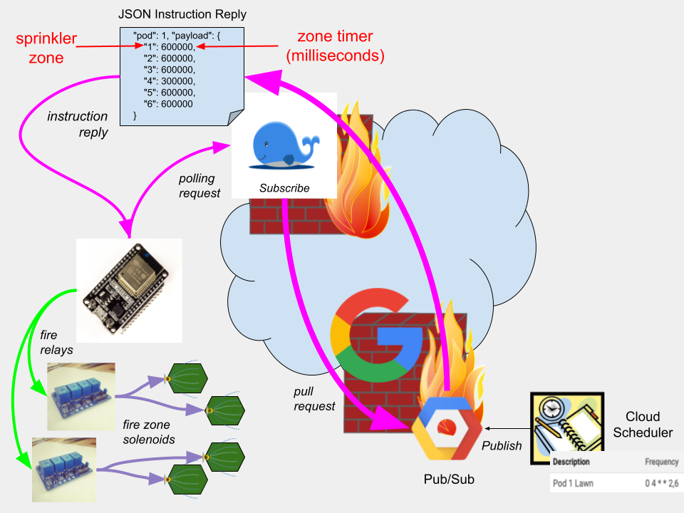

# MicroSprinklerApi

A Go quickstart project that acts as a pubsub subscription proxy of scheduler instructions destined to fire sprinkler 
relays which in-turn fire sprinkler solenoids.

**NOTE:**  Built to work seamlessly with [BinGo](https://github.com/wejafoo/bin-go) mife build/deploy utility

----

## Developer Install
Clone the git repository and link project root to your path.

$  `git clone git@github.com:micro-cosm/micro-sprinkler-api.git`

### Deploy Local Docker
$   `bingo --local`

### Deploy Remote Docker/Cloud
$   `bingo --remote --alias stage`
